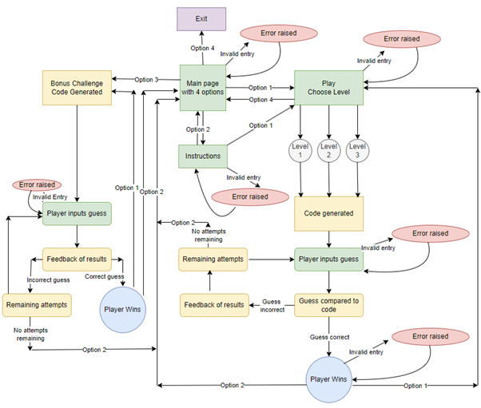
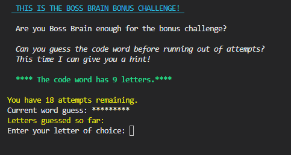

# **Boss Brain Challenge**

## **Introduction**

I have created a terminal-based code breaker game called Boss Brain Challenge, based on the original MasterMind board game that I loved playing in my younger years with my family and friends.
It has the same rules as the Mastermind game. The PC takes the place of the codemaker and the player is the codebreaker. The codemaker generates a secret code of 4 colours, there are 6 colours to choose from. Then the codebreaker has to guess the secret code in a number of attempts. The number of attempts depends on the level selected. Level 1 is 12 attempts, level 2 is 10 attempts and level 3 is 8 attempts.
I also added a bonus challenge where the player has to guess a code word. Here the amount of attempts you get is based on how many letters are in the word. I have set this at 2.0 x the length of the word. For example, if the word is 6 letters long then the player will get 12 attempts. I currently have 10 code words in a list and the computer will randomly pick a word each time the game is played.

### **Target Audience**

The original Mastermind game is suitable for ages 8+. This version of the game would be suitable for 8+ also though the younger ages may require adult supervision. It is a great family game, as a board game, though this is more a one person game playing against the PC, though you could play alternate games against the PC as a family and keep score as you would in the original board games, where the winner is the person who guesses the secret code in the least amount of attempts.

### **User Requirements**

- The player wants to engage in a challenging game to solve a secret code to become a Boss Brain.
- The player wants the choice to read the instructions prior to playing the game.
- The player wants to access the game from the main menu and choose which level they would like to play.
- When playing the game, the player wants to have feedback to which of their colors are correct and how many are in the correct place.
- The player needs to know how many attempts they have left as they are playing.
- The player wants to know if they have been successful in guessing the correct code in the given amount of attempts.
- If the player does not guess the correct code in the given amount of attempts, then they want to know what the secret code is.
- The player will want to exit the game after it has finished.

### **Flow Chart**

I created a flowchart to help visualise my concept. I found this very helpful during the testing stages of my project as I had missed out some of the error raises. I used draw.io's flow chart maker (http://app.diagrams.net/).

### **Technology**

I used Python (version 3.12.2 latest version at time of produce)

I also imported the below libraries which are used 

Random - this library is used for generating the random codes in both games.

Sys - this library is used in the blink_text function.

Time - this library is used in the blink_text function.

## **Current Features**

### **Main Page**

The first page that the player sees when the program is started tells the player that this is the Boss Brain Challenge and lists a choice of 4 options.

The player can choose to play the game, go to the instructions, play the bonus challenge or exit the game.
If the player chooses option 1 to play the game, they are then asked which level they would like to play. 
The choice is entered using the input() function.

### **Instructions Page**

After selecting option 2 from the main page, the player can read the Instruction For Play for the main game and the bonus game. At the bottom of the page the player has options to either play the main game, bonus game or return to the main page.

### **Bonus Challenge**

Option 3 takes the player to the bonus challenge where the players gets to guess a code word.
In the code here I have made a list of 10 code words that the computer chooses randomly for the player to guess. More words could be added here as once the player has guessed all 10 words it would become a bit boring.

When the bonus game is selected, this calls the generate_code_word() function into play. The word is choosen using the random.choice() function, from the list of 10 words. The program calculates the amount of attempts for the word based on 2 x the length of the word. The player gets a hint to say how many letters are in the code word. 
The game uses a loop so that the player can guess the word one letter at a time. 
The program checks if the letter is in the word and then gives feedback to the player.
Once the player has guessed hte word correctly, a congratulations message appears adn then the player can play again or retunr to the main page.

### **Exit Game**

On selecting option 4 from the main page, the below message is shown and the program is ended.

### **Play Game**

Option 1 from the main page or the instructions page takes the player to a choice of levels. There are 3 levels to choose from. Each level has a different amount of attempts at guessing the secret code. Here the play_game() function chooses the amount of attempts depending on which level is choosen by the player.

### **Level options**

When the player makes their choice of level, they are taken to the game and told how many attempts they have.

### **The secret Code generation**

To generate the secret code, I have imported the random library. I have created constants for the generation of this code. The COLORS list and also the CODE_LENGTH.
It used the random.choices() function to select 4 (k) colours from the list. This allows duplicates. 

### **Input Error Handling**

 I want to make sure that the player can only enter the valid data. I have used try except blocks to be able to tell the user when they have entered an incorrect value and then shows them the choices that they have, and tells them to try again. For the options where the player has to enter a number, the input is converted to a interger and if the value is not an integer, the error message is displayed. 
 When playing the main game there are a few checks to make sure the input is valid. They must choose specific letters corresponding to the colour guess. The code checks that it has a length of 4, and if the letter they guess is a valid letter. If the guess is not exactly 4 letters or they choose a letter other than R, B, G, Y, W or P, they will get an error message and be asked to try again. This does not use up an attempt.
 For the Bonus Challenge game, the program checks if the input is a valid letter that is in the code word, and whether the same letter is choosen twice. Again here, if an incorrect letter is entered or the same letter is entered twice, then the player gets a message to say something is wrong and they can try again. They don't loose an attempt in these instances.
 This helps with the robustness of the game.

 ### **How guess is compared to code**

In the main game the game needs to check for the correct colour in the correct place, as well as the correct colour in the wrong place. Here each colour in the players guess is compared to the colour in the code. This uses the zip(answer, code) function and pairs each colour from the guess against the corresponding colour in the secret code. The a == c chekcs if the colour from the answer (a) is the same as the colour from the code (c). Then the sum counts how many time the condition is true. 
When it comes to checking the correct position of the correct colour, the code counts how many times the colours from the players guess are in the code and then subtracts the number of correct positions. Using set(code) provides a unique set of colours. answer.count(c) counts how many times a colour appears in the guess, and the same for 
code.count in the secret code. Adding the min means that the minimum times a colour in both the guess and the code is counted and avoids counting the colour twice if it appears twice in the guess but only once in the secret code.
After these calculations have been done the player then get s feedback as to which colours are correct and in the correct position. 

### **End game options**

Once the player has guessed correctly, a congratulations message appears and then the options to either play again or return to the main menu. If the player chooses option 1 to play again, they are taken to the level choice page so they can then progress to the next level, or they could do the same level again for practice. They can also return to the main menu choosing option 2. If the player runs out of attempts before they guess the correct answer, they get a message to say they have run out of attempts and the secret code is revealed. Again the palyer has the option to play again or return to the main menu. Here again the input() function is used.

### **Clear Screen Function**

The clear_screen function is used at the start of each section so that the screen is cleared before the choosed section is run.
I used a simple method that works on all platforms. The line print("\n" * 50) means that 50 new lines are printed which scrolls the previous content so that it is no longer visible. The line \033c is the ANSI escape code so that the terminal will reset itself and clear the terminal.
This is used at the beginning of each section (the main page, the instructions page and the play game page) to clear the terminal screen. 

### **The Blink_Text Function** 

I have used this function in the main game so that the 'congratulations' message, the 'you are a boss brain' messgage and the 'you cracked the code message' appear one at a time for a more dramatic effect. I have put a break in after the while loop so this only runs once, giving the effect that I like, rather than flashing multiple times. I looked up how to do this and I could add a counter and specify how many blinks to have, however, I decided not to change this.

### **Credits**

I used this website for the blink_text function code.

https://handhikayp.medium.com/generate-a-blinking-text-with-very-simple-python-4c10750978f5#:~:text=The%20blink_text%20function%20continuously%20prints,state%2C%20creating%20the%20blink%20effec

Below are some sites that I visited to look at other python programs for a mastermind or letter codign game to get some ideas and inspiration. I also used pinterest site to get ideas for some encouraging quotes to add to some of the sections to help encourage the player in hte challenges.

https://www.youtube.com/watch?v=fTWaQ0zbxf0

https://www.youtube.com/watch?v=NLfxNo7Q0Pk

https://www.geeksforgeeks.org/python-program-for-word-guessing-game/

### **Bugs Fixed**

When I first added the blink_text function to get the Congratulations! message to flash, it was flashing continuously though this seemed to stop the rest of the code from runnint. It was stuck in an infinate while loop. I then put a break in the while loop. This made the Congratulations! message flash up, however then it dissappeared and then the next line was printed. If I put the print text function ton the 3 messages that come up after the game has been won, they flash up one by one. I like this affect though this wasn't what I wanted initially. I was hoping for the congratulations message to be flashing continously with the to messages below printed. 

When I was trying to add the secret code at the end of the game to confirm the code if you win or let you know the code if you loose, I couldn't get this to work but then realised I was using {generat_random_code_} instead of {code}.

I wanted the names of the colours written on the game play screens to be coloured. As they were being picked up from the color constant list, I couldn't see how to change the colour of the text. I tried by adding the ANSI codes to the color list items, however this did not work. I then decided to use the same coding that I had used to change the color of the text for the colours on the instructions part. This has worked well.

During the tesing stages I realised that after the player guesses the code correctly, within the given amount of attempts, after then choosing option 2 to return to the main page, if you then choose option 3 to eixt the game you get the exit message but then also the next line prints out "Attempt 2/12....". I had removed the exit function when I had added the options to retunr to the main page. Once the exit function was added back into the code this all worked smoothly again

When testing the instructions page, on entering an invalid option, the message 'Invalid key press...' comes up, however the program is then ended. I realised I had an end() at the bottom of this section that should not have been there. Als the indentation was incorrect in this section and there was a break that shouldn't have been there. Now it is working.

On the Bonus challenge game I was trying to figure out how to make make sure the player can only enter letter characters. I eventually managed this by adding the isalphafunction to the attempt.

When testing the bonus challenge, after running out of attempts, the message came up but kept scrolling and got stuck in a loop. I corrected the indentation in the code for this loop and this is now working.

### **Improvements as going along**

Initially the player had to write the name of each of the colours out. I was was testing out my coding I was finding this very time consuming and heavy on the finger usage. I decided to use the first letters of each of the colours instead which made it much simpler and enjoyable. I also added the .upper so that the player can inut lowercase or uppercase letters and either will be excepted.

One of the messages that comes up at the end of the game is 'You have a Boss Brain!'. This message is slightly different in each of the levels. In level 1 there is 1 exclamation mark to end the message. In level 2, there are 2 exclamation marks and in level 3 there are 3 exclamation marks. This marks a greater level of achievement for the hogher levels.

For the clear_screen function, the code I initially used only works on windows using the imported os library. I then changed this to a method where effectively, a number of blank lines are inserted to give the illusion of a new page at the stat of each section. This works well across all platforms.

I decided to add a bonus level where the player gets to guess a code word.

Initially, I didn't have the instructions wording on the game page, however, after deploying the game, I sent the link to a few friends to try out and the feedback I had was that it wasn't clear that more than one colour could be in the code and that it wasn't clear that you had to just enter the first letter. Although this is written cleary (I think) in the instructions, it seems people don't really read the instructions properly, if at all.
Other feedback was that you couldn't remember the colours once you have had a few guesses as the list at the top disappears after a few guesses. I then added the coloured letters in brackets after the make your attempt input line so that the player can always see the colour choices.

### **Testing**

The testing has been documented in a seperate md file. Please follow this link to access the testing information: [**TESTING.md**](TESTING.md)

### **Deployment to Heroku**

To deploy this project to Heroku, the following procedure was followed:

1. From the Heroku dashboard, click on 'New' in the top right-hand corner, and select "Create New App" from the drop-down menu.
1. Enter a unique name for the app (this project uses "mastercode-breaker").
1. When a unique name that is available has been provided, select your region.
1. Click on the "Create App" button.
1. The page that will now be displayed contains important information for setting up the app, across different tabs. First navigate to the "Settings" tab.
1. Scroll to the section called "Config Vars", and click on the button that says "Reveal Config Vars".
1. In the left-hand input field labelled "KEY", enter "PORT".
1. In the right-hand input field labelled "VALUE", enter "8000".
1. Scroll down to the next section called "Buildpacks", and click on the button that says "Add buildpack".
1. Select "python" from the list, then click on the button that says "Add buildpack".

- **IMPORTANT:** It is extremely important that you add Python's buildpack first, as detailed here. Buildpacks must be added in the correct order, and for this project to work, Python must come first.

1. Once Python has been added, click on the "Add buildpack" button once more, and select "nodejs" from the list. Click on the button that says "Add buildpack" to add node.js AFTER Python.
1. Scroll back up to the top of the page, and navigate to the "Deploy" tab.
1. Under the "Deployment method" section, select GitHub as the deployment method, and confirm that you wish to connect to GitHub.
1. Search for the project's GitHub repository name, and click the "Connect" button when you have located the correct one.
1. Scroll further down the page to see two separate options regarding the deployment method. The project can be deployed automatically from GitHub pushes by clicking "Enable Automatic Deploys" under the "Automatic deploys" section, or manually by selecting the branch to be deployed from (ie 'main') in the "Manual deploys" section.
1. The project is now successfully deployed on Heroku.

[**_For a chance to play the game please follow this link to the final deployed version._**]
(https://boss-brain-6bb345094ff6.herokuapp.com/) 