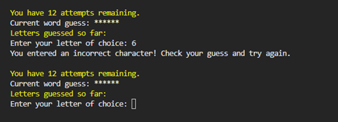

# **Testing**

I found it inportant to be constantly testing my code as I progressd further through my project.
It was important to make sure that all the input options worked correctly and that only the correct data could be entered by the player and that the correct messages where received depending on what had been inputed.

Using a print statement to print out the secret code in the main game and the code word in the bonus game was essential as part of the testing so that I could check all the different combinations by deliberatley getting the colurs in the incorrect places as well as the correct places to make sure that the feedback was correct every time.
See below examples of different outcomes and messages.

Ths shows main game level 1, game won in 5 attempts.

This shows main game level 2 to include a guess with no spaces to show the 'you've done something wrong message!' appears.

This shows main game level 3 to include a guess with numbers to show the 'you've done something wrong message!' appears.

This shows main game level 1, winning in 3 attempts and shows that the feedback is correct.

This shows main game level 2 with some different combinations of incorrect answers before the game is won in 6 attempts.

This shows main game level 3 with some different combinations of incorrect answers before the game is won in 4 attempts.

This shows the message after an incorrect guess has been made, and asks the player to try again. You can see that the attempt number stays the same.

Here you can see that if you enter a number and as well only 1 character the message 'you've done something wrong message!' appears.

This shows the first attempt of the guess works.

This shows an incorrect guess with no spaces and that the number of attempts is still the same after this incorrect guess.

This shows that you can use upper case letters also and the answer will still be accepted.

This shows the winning message on the main game.

This shows that in the bonus game, if you try to enter the same letter twice, you get the error message.

This shows the bonus level first guess is working.

This shows that if you try to enter a number in the bonus game, you will get the error message.

This shows winning the bonus games.

## **Validation Testing with CI Python Linter**

Once my code was completed and I was happy that I had solved all the bugs that I had encountered and deemed there to be no more bugs in my program at this time, I ran my code thorugh the CI Pythn linter for validation. It did at first contain white space and trailing white space along with messagesa bout some lines being too long. Once the program had been deployed, I then went through the code and made sure that each of the sentences fitted on the screen. There are still some long sentences that show up as error codes in the linter however these are comments or sentences that include the ANSI colour codes for the text.

## **Testing in the field**

Once I had deployed my game I sent it out to friends and family for some player feedback.
I have written about the feedback I was given in the README file. This feedback was very valuble to me and helped me to add some clearer instructions on how to play the game and make sure it was both simple and enjoyable to play. Some other feedback I had was that the game was quite addictive and the players liked the challenge of playing again to try and guess the code in fewer attempts.
Not many people tried the bonus game.

Follow this link to return to the [**README.md**](README.md)